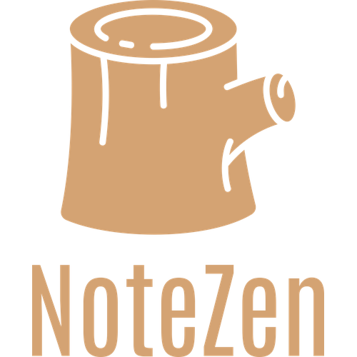

#  NoteZen

NoteZen is my first app project which helps to store, sort and format written memo for easy referencing.

## Table of contents
  - [Background](#background)
  - [Getting Started](#getting-started)
  - [Prerequisites](#rerequisites)
  - [Installing](#installing)
  - [Running the tests](#running-the-tests)
  - [Deployment](#deployment)
  - [Project Development](#project-development)
  - [Authors](#authors)
  - [Acknowledgments](#acknowledgments)


## Background 
[(Back to top)](#table-of-contents)

Often I like to translate my learning experience and ideas into writing. Keeping and revisiting these written notes had grdually become cumbersome as I do not have a structured way to organize the notes. This motivates me to come up with an app.

## Design Features
[(Back to top)](#table-of-contents)

 The final product of his project should offer features below  to optimize the notes management:
  - 🔍 Search box to find notes by keywords
  - 

## Getting Started
[(Back to top)](#table-of-contents)

These instructions will get you a copy of the project up and running on your local machine for development and testing purposes. See deployment for notes on how to deploy the project on a live system.

### Prerequisites

List of things required to install the software and how to install them (Under Construction)

```
Under Construction
```

### Installing

How to get a development env running
-steps: Under Construction)

```
demo 1
```
Under Construction
```
demo2
```

## Running the tests
[(Back to top)](#table-of-contents)

How to run the automated tests for this system (Under Construction)

### Break down into end to end tests

Purpose of the tests (Under Construction)

```
demo 1
```

### And coding style tests

Purpose of the tests (Under Construction)
```
demo 1
```

## Deployment
[(Back to top)](#table-of-contents)

Notes about how to deploy this on a live system (Under Construction)

## Project Development
[(Back to top)](#table-of-contents)

Project Structure For The Frontend:

    ├── index.js
    ├── app.js
    ├── dist
    │   └── ...
    ├── controllers
    │   └── notes.js
    ├── models
    │   └── note.js
    ├── package-lock.json
    ├── package.json
    ├── utils
    │   ├── config.js
    │   ├── logger.js
    │   └── middleware.js 

Tools Use for developing this project:

### Frontend:
* [Icons8 Icons](https://icons8.com/icons)
* [RemixIcon Icons](https://remixicon.com/)
* [Vite](https://vitejs.dev/) -                   Frontend development server for React development process.
* [Material UI](https://mui.com/material-ui/) -   A React component library w/ powerful design materials.
* [React Router](https://github.com/remix-run/react-router) - Single-page web/app w/ routing effects. 
* [Zustand](https://github.com/pmndrs/zustand) -  State management ideal for smaller projects.
* [Highlight-words](https://github.com/bvaughn/react-highlight-words) - For making highlighted search term
* [Moment.js](https://momentjs.com/) -            Display manipulated dates and time
* [Tiptap](@tiptap/react @tiptap/pm @tiptap/starter-kit)    - Allows rich-text editing for NoteZen
   ```
   npm create vite@latest <project directory name> --template react
   ```
   ```
   npm install 
    moment 
    zustand 
    react-router-dom
    react-highlight-words
    @mui/material @emotion/react @emotion/styled
   ```
### Backend/Server:
* [Express](https://www.npmjs.com/package/express) -  Framework for Node.js
* [Nodemon](https://github.com/remy/nodemon/) -       For devoloping Node.js apps w/ automatic restart
* [morgan](https://github.com/expressjs/morgan) -     HTTP request logger middleware for node.js
* [UUID](https://github.com/uuidjs/uuid#readme) -     For creating unique UUID for each new element entry
* [MongoDB](https://www.mongodb.com/) -               Cloud database for the app  
* [bcrypt](https://github.com/kelektiv/node.bcrypt.js)- Library for hashing passwords
* [Axios](https://github.com/axios/axios) -           Library for making HTTP requests    
* [CORS](https://github.com/expressjs/cors) -         Eliminate the 'block by CORS policy' issue
* [dotenv](https://github.com/motdotla/dotenv) -      Keep enviroment vars separate from code
* [uniqueValidator](https://www.npmjs.com/package/mongoose-unique-validator)- A MongoDB plugin validating in Mongoose schema
* [JSON Web Tokens](https://github.com/auth0/node-jsonwebtoken)-
                                                      Safe exchange of information from A to B as JSON object
  ```
  npm install 
    cors
    uuid    
    morgan
    bcrypt
    dotenv
    express
    mongoose
    jsonwebtoken
    --save-dev nodemon
    mongoose-unique-validator
  ```
  ```
  npm update
  ```
### Testing:
* [Postman](https://www.postman.com/) -        For testing various backend operations (delete, post, put...etc)
* [Rest Client](https://marketplace.visualstudio.com/items?itemName=humao.rest-client) -    For testing backend operations

## Authors
[(Back to top)](#table-of-contents)

**Eric Jen** 

## Acknowledgments
[(Back to top)](#table-of-contents)
* Hat tip to anyone whose code was used
* Inspiration
* etc